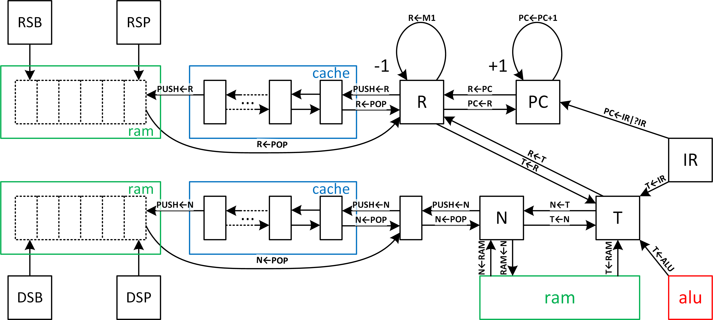

## uf16

The UF16 is a 16-bit stack machine with several notable features:

- Compact area footprint
- Low-latency interrupt response
- Support for preemptive multitasking
- Low power consumption with a sleep instruction
- Compatibility with the Forth programming language

The Forth language offers an interactive interface to hardware, simplifying the software/hardware debugging process. Additionally, it generates highly compact code, reducing memory size requirements. To enhance Forth performance, the UF16 includes a fast call instruction and hardware tail call optimization.

The UF16 employs a three-stage pipeline (fetch, decode, and execute) that maximizes memory performance, with a clock period equal to memory access time. Moreover, the short pipeline results in a low branch penalty, which is particularly beneficial since Forth relies heavily on branch and call instructions compared to other programming languages.

## Architecture

The UF16 architecture was specifically designed with a compact area footprint in mind, followed by enhancements aimed at improving speed performance. It features two stacks: a data stack and a return stack, both of which reside in memory. This design choice minimizes gate count and facilitates rapid task switching.

Utilizing a Von Neumann architecture, the UF16 accesses code, data, and I/O through a single bus, which is also employed for push and pop instructions. Additionally, some internal registers are utilized to cache push and pop data, effectively reducing memory bandwidth pressure.

In the UF16 architecture, the DSP (Data Stack Pointer) and RSP (Return Stack Pointer) internal registers are designated for managing the data and return stacks, respectively. Push and pop instructions automatically update the DSP and RSP registers. The DSPB and RSPB registers indicate the bottoms of the data and return stacks and are used to check for underflow exceptions.

The T register holds the top of the data stack (TOS), while the N register contains the next item below the TOS. The R register maintains the top of the return stack. The push instruction writes a new item to RAM and updates the DSP or RSP only when the cache queue is full. Conversely, the pop instruction reads an item from RAM and updates the DSP or RSP only when the cache queue is empty.

When the data stack is empty, the condition is indicated by DSP=DSPB, and for the return stack, it is RSP=RSPB. The data stack begins at DSPB+1 and grows towards higher memory addresses, while the return stack starts at RSPB−1 and grows towards lower memory addresses.

A stack overflow is signaled when the push instruction causes the DSP to equal the RSP. Both stack underflow and overflow events trigger a hardware exception, leading to a jump to the service routine specified by the `EXCEPTION_ADDR` parameter. Hardware interrupts are indicated by the `irq_i` input pin, causing a jump to the service routine defined by the `irqaddr_i` input pins.

In the UF16 architecture, a single instruction can perform two memory accesses: one for data reading and another for data writing. The memory read operation is initiated at the end of the decode stage, with the read data being stored in registers by the end of the execute stage. In contrast, the memory write operation is launched at the end of the execute stage.

The PC (Program Counter) register points to the address of the next instruction and is typically incremented by 1. A code jump is executed by loading the PC with the instruction register (IR) when the jump address is specified as immediate data. Alternatively, it can be loaded with the R register, for example, when returning from a subroutine.

Data loading between registers or between registers and memory is selectable within the instruction code. This flexibility allows for the specification of how to load each register within the same instruction.

## Instruction Set

In the UF16 architecture, the  instruction size is consistently two bytes for all instructions, except  for those that require an immediate operand, such as branching to an  address or loading immediate data. For these instructions, an additional two-byte operand is necessary.

However, there are equivalent two-byte instructions that utilize reduced-size operands. For example, the `call` instruction has a 2 + 2 byte version, where the last two bytes specify  the callee address. There is also a compact version that consists of  only 2 bytes, where the most significant bit (MSB) is set to `1` to distinguish it from other instructions. The lower 15 bits of this  instruction represent the callee address, which is sufficient to address the entire addressable space.

|             | **15** | **14** | **13** | **12** | **11** | **10** | **9** | **8** | **7** | **6** | **5** | **4** | **3** | **2** | **1** | **0** |
| ----------- | ------ | ------ | ------ | ------ | ------ | ------ | ----- | ----- | ----- | ----- | ----- | ----- | ----- | ----- | ----- | ----- |
| **ucode**   | 0      | 0      | u₁₃    | u₁₂    | u₁₁    | u₁₀    | u₉    | u₈    | u₇    | u₆    | u₅    | u₄    | u₃    | u₂    | u₁    | u₀    |
| **branch**  | 0      | 1      | 0      | 0      | r₁     | r₀     | a₉    | a₈    | a₇    | a₆    | a₅    | a₄    | a₃    | a₂    | a₁    | a₀    |
| **branchz** | 0      | 1      | 0      | 1      | r₁     | r₀     | a₉    | a₈    | a₇    | a₆    | a₅    | a₄    | a₃    | a₂    | a₁    | a₀    |
| **next**    | 0      | 1      | 1      | 0      | r₁     | r₀     | a₉    | a₈    | a₇    | a₆    | a₅    | a₄    | a₃    | a₂    | a₁    | a₀    |
| **ldi**     | 0      | 1      | 1      | 1      | i₁₁    | i₁₀    | i₉    | i₈    | i₇    | i₆    | i₅    | i₄    | i₃    | i₂    | i₁    | i₀    |
| **call**    | 1      | a₁₄    | a₁₃    | a₁₂    | a₁₁    | a₁₀    | a₉    | a₈    | a₇    | a₆    | a₅    | a₄    | a₃    | a₂    | a₁    | a₀    |

In the UF16 architecture, instructions fetched from memory are decoded during the decode stage, and the results are stored in the internal instruction register. This register consists of the `UIR`, which holds the instruction to be executed, and the `LIT` register, which contains any immediate data if present.

The `UIR` is composed of 18 bits, structured as follows:

- Bits 17-16: **EXT_ALU[1:0]**
  - These two bits select the meaning of the less significant 4 bits that define the ALU operation.
- Bits 15-14: **EXT_RAM[1:0]**
  - These two bits define the second RAM access operation.
- Bit 13: **N[0]**
  - This bit defines the load operation of the `N` register.
- Bits 12-11: **T[1:0]**
  - These two bits define the load operation of the `T` register.
- Bits 10-9: **R[1:0]**
  - These two bits define the load operation of the `R` register.
- Bits 8-7: **PC[1:0]**
  - These two bits define the load operation of the `PC` register.
- Bits 6-4: **RAM[2:0]**
  - These three bits define the RAM access operation.
- 3-0: **ALU[3:0]**
  - These four bits, in conjunction with **EXT_ALU[1:0]**, define the ALU operation.

### `ucode` Instruction

`ucode` instruction has the two MSB bits equal to '00'. The other bits define the operations that has to be executed according to following table:

| **#** | **N[0]=u₁₃** | **T[1:0]=u₁₂,u₁₁** | **R[1:0]=u₁₀,u₉** | **PC[1:0]=u₈,u₇** | **RAM[2:0]=u₆,u₅,u₄** | **ALU[3:0]=u₃,u₂,u₁,u₀** |
| ----: | ------------ | ------------------ | ----------------- | ----------------- | --------------------- | ------------------------ |
|     0 | NOP          | NOP                | NOP               | PC←PC+1           | NOP                   | NOP                      |
|     1 | N←T          | T←N                | R←M1              | PC←R              | N←POP                 | NOT                      |
|     2 |              | T←R                | R←PC              | PC←IR             | R←POP                 | AND                      |
|     3 |              | T←IR               | R←T               | PC←?IR            | N←RAM                 | OR                       |
|     4 |              |                    |                   |                   | T←RAM                 | XOR                      |
|     5 |              |                    |                   |                   | PUSH←N                | SHL                      |
|     6 |              |                    |                   |                   | PUSH←R                | SHR                      |
|     7 |              |                    |                   |                   | RAM←N                 | ADD                      |
|     8 |              |                    |                   |                   |                       | SUB                      |
|     9 |              |                    |                   |                   |                       | MUL                      |
|    10 |              |                    |                   |                   |                       | DIV                      |
|    11 |              |                    |                   |                   |                       | ADD1                     |
|    12 |              |                    |                   |                   |                       | ADD2                     |
|    13 |              |                    |                   |                   |                       |                          |
|    14 |              |                    |                   |                   |                       |                          |
|    15 |              |                    |                   |                   |                       | CARRY                    |

- **`N[0]`** bit defines if register `N` has to be loaded with the content of register `T`.
- **`T[1:0]`** bits define if register `T` has to be loaded with the content of one of the registers `N`, `R` or `IR` (immediate value).
- **`R[1:0]`** bits define if register `R` has to be loaded with the content of register `T`, or register `PC` or decremented by 1 (M1).
- **`PC[1:0]`** bits define how the program counter `PC` has to be loaded.
- **`RAM[2:0]`** bits define the memory access operation:
  - **`N←POP`**: pop data from data stack. This could require a memory read if data cache is empty.
  - **`PUSH←N`**: push data into data stack. This could require a memory write if data cache is full.
  - **`R←POP`**: pop data from return stack. This could require a memory read if return cache is empty.
  - **`PUSH←R`**: push data into return stack. This could require a memory write if return cache is full.
  - **`N←RAM`**: data read from memory into register `N`.
  - **`T←RAM`**: data read from memory into register `T`.
  - **`RAM←N`**: data write into memory from register `N`.
- **`ALU[3:0]`** bits define the ALU operation to be executed:
  - **`NOT`**: bit inversion of register `T` content.
  - 

| **#** | **EXT_ALU[1:0]** | **EXT_RAM[1:0]** | **N[0]** | **T[1:0]** | **R[1:0]** | **PC[1:0]** | **RAM[2:0]** | **ALU0[3:0]** | **ALU1[3:0]** | **ALU2[3:0]** | **ALU3[3:0]** |
| ----: | ---------------- | ---------------- | -------- | ---------- | ---------- | ----------- | ------------ | ------------- | ------------- | ------------- | ------------- |
|     0 | ALU0             | 00               | 0        | 00         | 00         | 00          | 000          | 0000          |               |               |               |
|     1 | ALU1             | PUSH←N           | N←T      | T←N        | R←M1       | PC←R        | N←POP        | NOT           |               |               |               |
|     2 | ALU2             | PUSH←R           |          | T←R        | R←PC       | PC←IR       | R←POP        | AND           |               |               |               |
|     3 | ALU3             | RAM←N            |          | T←IR       | R←T        | PC←?IR      | N←RAM        | OR            |               |               |               |
|     4 |                  |                  |          |            |            |             | T←RAM        | XOR           |               |               |               |
|     5 |                  |                  |          |            |            |             | PUSH←N       | SHL           | SHLC          |               |               |
|     6 |                  |                  |          |            |            |             | PUSH←R       | SHR           | SHRC          |               |               |
|     7 |                  |                  |          |            |            |             | RAM←N        | ADD           | ADDC          |               |               |
|     8 |                  |                  |          |            |            |             |              | SUB           | SUBC          |               |               |
|     9 |                  |                  |          |            |            |             |              | MUL           |               |               |               |
|    10 |                  |                  |          |            |            |             |              | DIV           |               |               |               |
|    11 |                  |                  |          |            |            |             |              | ADD1          | ADD1C         |               |               |
|    12 |                  |                  |          |            |            |             |              | ADD2          | ADD2C         |               |               |
|    13 |                  |                  |          |            |            |             |              |               |               |               |               |
|    14 |                  |                  |          |            |            |             |              |               | IRQEN         | IRQSET        |               |
|    15 |                  |                  |          |            |            |             |              | CARRY         | SLEEP         | IRQDIS        |               |
